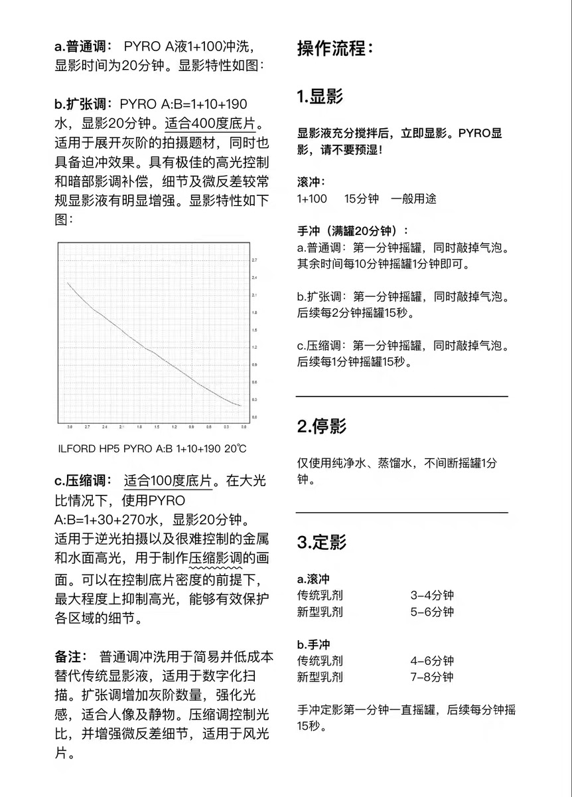

# 黑白胶片冲洗配方

## 工具清单

### 核心冲洗设备

| 工具            | 推荐规格 / 备注                                              | 必要性   |
| :-------------- | :----------------------------------------------------------- | :------- |
| **显影罐**      | AP 或派森两用罐（2 卷 135 或 1 卷 120）。耐酸碱塑料，易清洗。 | ⭐⭐⭐ 必备 |
| **显影轴**      | 与罐匹配；建议 135/120 各一，避免药膜交叉污染。               | ⭐⭐⭐ 必备 |
| **引片器**      | 从暗盒中取出片头。                                           | ⭐⭐⭐ 必备 |
| **暗袋**        | 双层红黑遮光，足够大，明室装卷用。                           | ⭐⭐⭐ 必备 |
| **温度计**      | 水银或酒精，量程 0–50°C，精度 0.5°C；比电子式更稳定。         | ⭐⭐⭐ 必备 |
| **量筒/量杯**   | 至少 2 个：100ml 量原液，500–1000ml 配工作液；塑料为宜。     | ⭐⭐⭐ 必备 |
| **刻度瓶**      | 带刻度、可拧盖摇晃的塑料瓶。                                 | ⭐⭐ 推荐 |
| **计时器**      | 手机或厨房计时器，有响铃，精度到秒。                         | ⭐⭐⭐ 必备 |
| **搅拌棒**      | 玻璃或塑料，搅拌药液。                                       | ⭐⭐ 推荐 |
| **漏斗**        | 药液倒回储存瓶时减少泼溅。                                   | ⭐⭐ 推荐 |
| **剪刀**        | 剪断胶卷片头。                                               | ⭐⭐⭐ 必备 |
| **片夹**        | 装轴前固定胶卷，防松散。                                     | ⭐⭐ 可选 |

### 药水与耗材

| 工具           | 推荐规格 / 备注                                              | 必要性               |
| :------------- | :----------------------------------------------------------- | :------------------- |
| **显影液**     | 派森 BW-60 或 PYRO-A（焦酚）等。                             | ⭐⭐⭐ 必备             |
| **定影液**     | 派森 BW-62 或强品 C41 等。                                   | ⭐⭐⭐ 必备             |
| **停显液**     | 派森 BW-63 或自配（30ml 99% 冰醋酸 + 970ml 水），保护定影液。 | ⭐⭐ 推荐              |
| **润湿液**     | 柯达 Photo-Flo 或伊尔福 Ilfotol，防水渍。                     | ⭐⭐⭐ 必备             |
| **去海波液**   | 派森 BW-65 等，彻底去除定影残留，显著提升长期保存性。       | ⭐⭐⭐ 长期保存必备     |
| **纯净水**     | 配药与最终水洗用蒸馏水或纯净水，避免杂质与水垢。             | ⭐⭐⭐ 必备             |
| **药液储存瓶** | 棕色玻璃或 HDPE 塑料瓶，避光、密封。                         | ⭐⭐ 推荐              |

### 干燥与防尘

| 工具             | 推荐规格 / 备注                                              | 必要性                  |
| :--------------- | :----------------------------------------------------------- | :---------------------- |
| **胶片夹**       | 不锈钢重锤夹 + 上夹，下端重锤防卷曲。                        | ⭐⭐⭐ 必备                |
| **海绵夹**       | 干燥前轻夹去表面水分，保持清洁防划伤；熟练后可仅用润湿液。  | ⭐⭐ 可选                 |
| **无尘干燥空间** | 干燥柜或简易防尘罩；避免在灰尘大的地方晾干。                 | ⭐⭐⭐ 长期保存必备        |
| **吹气球**       | 干燥后吹去表面灰尘。                                         | ⭐⭐ 推荐                 |

### 长期保存与归档

| 工具                | 推荐规格 / 备注                                              | 必要性               |
| :------------------ | :----------------------------------------------------------- | :------------------- |
| **无酸底片袋**      | 聚丙烯或聚乙烯、无酸、PVC-free；普通塑料袋会释酸腐蚀胶片。  | ⭐⭐⭐ 长期保存核心    |
| **无酸保存册/盒**   | 无酸活页册或保存盒，避光、防潮。                             | ⭐⭐⭐ 长期保存核心    |
| **手套**            | 整理底片时戴棉质或丁腈手套，防油脂汗液污染。                 | ⭐⭐ 推荐              |
| **记号笔**          | 在袋/册上记录日期、胶卷、配方、内容；建议软性笔，防压坏底片。 | ⭐⭐⭐ 必备             |
| **放大镜/观片器**   | 检查密度、颗粒与瑕疵。                                       | ⭐⭐ 可选              |
| **防潮剂**          | 湿度 >60% 时可在盒内放硅胶干燥剂。                           | ⭐⭐ 视环境而定        |

### 核心建议

1. **水洗要彻底**：残留定影液（硫代硫酸钠）会与银反应导致发黄、褪色。使用去海波液并保证最终流动水洗 20min 以上，是延长胶片寿命的关键。
2. **无酸材质**：底片袋与保存册须无酸、PVC-free；劣质材料会破坏冲洗成果。
3. **存放环境**：阴凉（约 15–20°C）、干燥（相对湿度约 30–50%）、避光防尘；避免阁楼、地下室、暖气旁。
4. **整理时戴手套**：指纹与汗渍会永久污染乳剂。

### 进阶 / 提升便利性工具

| 工具           | 推荐规格 / 备注                                              | 必要性                  |
| :------------- | :----------------------------------------------------------- | :---------------------- |
| **水浴盆**     | 大塑料盆装恒温水，显影罐浸入以维持温度；室温波动大时推荐。   | ⭐⭐ 推荐                 |
| **冲洗泵管**   | 部分显影罐配件，可不开盖注入/倒出药液。                      | ⭐⭐ 可选                 |
| **电子秤**     | 自配药粉需精度 0.1g。                                        | ⭐ 未来可能              |
| **除水渍刮板** | 比海绵夹更专业，操作须小心防划伤。                           | ⭐ 可选                  |

## 负冲流程

### 🧪 冲洗配方

**基础设定**：所有步骤药液温度 **20°C**；稀释比例均为 **药液：水**。除定影液外，显影液等建议一次性使用以保证稳定。

| 步骤            | 药水型号                            | 稀释比例                                 | 温度     | 搅动方式                                   | 时间           | 备注                                                         |
| :-------------- | :---------------------------------- | :--------------------------------------- | :------- | :----------------------------------------- | :------------- | :----------------------------------------------------------- |
| **1. 预湿**     | 清水                                | /                                        | 20°C     | 持续搅动                                   | 1min           | 充分润湿，显影更均匀。                                       |
| **2. 显影**     | BW-60                               | 1+19（30ml+570ml）                       | 20°C     | 首 min 持续搅动，此后每 min 搅动 10s        | 见下表         | 1+19 颗粒更细腻；倒出时迅速。                               |
| **3. 停显**     | 停显液（BW-63 或自配冰醋酸）        | 1+19 或按说明（30ml+570ml）              | 20°C     | 持续搅动                                   | 30s            | 中和显影液、保护定影液；无专用停显可用清水（效果略弱）。     |
| **4. 定影**     | BW-62                               | 1+4 或 1+9（120ml+480ml）                | 20°C     | 每 min 搅动 10s                            | 8–10min        | BW-62 为硫代硫酸钠配方，定影较慢，时间须给足；1+4 可加快。  |
| **5. 去海波**   | 去海波液（如 BW-65）                | 1+9（60ml+540ml）                        | 20°C     | 持续搅动                                   | 3–4min         | 高效去除残留海波，缩短后续水洗。                             |
| **6. 最终水洗** | 流动清水                            | /                                        | 室温     | 持续水流                                   | 20min 以上     | 水管接罐轴中心，水从底部流出带走杂质。                       |
| **7. 除水渍**   | 除水渍液（如 Ilford Photo Flo）     | 1+200（3ml+600ml）                       | 室温     | 浸泡，勿剧烈搅动                           | 1–2min         | 浸泡后取出即可，避免产生泡沫。                               |

### 📷 显影时间

| 胶卷型号             | 显影时间 / min | 数据来源与备注                                               |
| :------------------- | :------------- | :----------------------------------------------------------- |
| **福马 Fomapan 100** | **6 - 7**      | 由 100 度胶卷特性推断，起始建议 **6:30**。                   |
| **福马 Fomapan 200** | **7 - 8**      | 感光度介于 100 和 400 之间，起始建议 **7:30**。              |
| **福马 Fomapan 400** | **9 - 10**     | 结合上一卷的经验和搜索结果，起始建议 **9:30**。              |
| **乐凯 100**         | **7**          | 有搜索结果显示派森官方在 1+9 配比下曾给出 7min 的数据。在 1+19 下可保持不变或略减至 6:30。 **容易高光溢出**（亮部容易过曝失去细节）。如果冲洗后发现高光部分太“死白”，可适当**减少 10%-20% 显影时间**，或尝试**降低搅动频率**（比如减少每 min 的搅动次数）来控制反差。 |
| **乐凯 400**         | **11 - 13**    | 无直接数据。根据经验，400 度胶卷需要更长时间。有同好曾用类似配方冲乐凯飞机卷（约 400 度）达 13min，反差较大。追求反差适中可从 **11:30** 开始尝试。 |

### 💖 通用配方

基于焦酚的简单通用配方 by [Van孙鹏](https://space.bilibili.com/48151792?spm_id_from=333.788.upinfo.detail.click)：

- 显影罐：JOBO 1000（标示容量 260ml）
  - 片芯建议用不锈钢，间距更大，不容易卡气泡。
  - 可用 300ml 冲洗，液面稍高避免片芯挂上敲罐的气泡，也减少氧化。
- 塑料瓶：带刻度的血清瓶（500ml）
- 显影液：PYRO-A（焦酚）
- 定影液：强品 C41

| 步骤              | 药水型号 | 稀释比例             | 温度 | 搅动方式                                                     | 时间    | 备注                                                         |
| :---------------- | :------- | :------------------- | :--- | :----------------------------------------------------------- | :------ | :----------------------------------------------------------- |
| **1. 配制显影液** | 焦酚     | 1+100 3ml+300ml | 20°C | 摇晃使之充分溶解                                             | -       | 1+100 比例无需担心氧化衰减，反而焦酚氧化后可以多增加染色。   |
| **2. 显影**       |          |                      | 室温 | 第 1min 和第 11min 持续翻转 其余时间静置 最后用力敲罐底 | 20min   | 敲罐底避免气泡卡在片芯上。 倒出                         |
| **3. 停显**       | 清水     | 300ml                | 室温 | 持续翻转                                                     | 1min    | 由于黑白冲洗是顺序污染，瓶子可以最后再洗。                   |
| **4. 配制定影液** | C41      | 1+6 50ml+300ml  | 20°C | 摇晃使之充分溶解                                             | -       |                                                              |
| **5. 定影**       |          |                      | 室温 | 第 1min 持续翻转 每 min 持续翻转 15s                    | 5min    | 先开罐提出片芯，观察片基是否已透。                           |
| **6. 水洗**       | 清水     | 300ml                | 室温 | 提起片芯上下冲刷 柯达水洗法：第 1min 5 次，第 2min 10 次，第 3min 20 次 | 3min 起 | 上下冲刷比摇晃更彻底，要把片基洗得更透，可洗更长时间。 最后晾起底片、用海绵擦干（有条件可烘干以避免沾染灰尘）。 |

**补偿显影**：过曝/欠曝都会影响底片曲线一端；延长显影可部分补偿（影调扩张近似线性：显影时间翻倍，密度近似等比例增加）。

**补偿液**在高稀释比下缩短显影时间、减少长时间显影的不稳定，抑制高光、补偿暗部、提升微反差（例：1+300 加 B 液约 15min 可替代仅 A 液 60min）。大光比场景可用此法保留细节与灰阶。

配置例：1ml A 液 + 30ml B 液 + 270ml 水（以替代 1ml A 液 + 300ml 水），搅动改为每 2min 翻转 15s，总时间约 15min（60min -> 15min）。

### 💡 注意事项

- **显影液不建议复用**；定影液可复用并补充原液。为底片效果，显影液一次性使用更稳妥。
- **记录与微调**：配方表为起点；每次冲洗记录时间、温度、搅动与效果，便于总结与微调。

## 正冲流程

### 🧪 冲洗配方

**基础设定**：所有步骤药液温度严格 **20°C**。

| 步骤             | 药水 / 配方                                               | 温度     | 搅动方式                             | 时间       | 关键提示与原理                                               |
| :--------------- | :-------------------------------------------------------- | :------- | :----------------------------------- | :--------- | :----------------------------------------------------------- |
| **1. 首显**      | 派森 BW-61（或 D-72）1:9（60ml+540ml）                    | 20°C     | 首 min 持续搅动，此后每 min 搅动 10s | 见下表     | 核心步骤：将曝光部分银盐显影；时间与温度须精确，直接影响正像密度与反差。 |
| **2. 停显**      | 清水或停显液（BW-63）600ml                                | 20°C     | 持续搅动                             | 1min       | 立即中止首显，保护后续药液。                                 |
| **3. 水洗**      | 流动清水                                                  | 20°C     | 持续水流                             | 5min       | 务必彻底，否则显影液污染漂白液，产生难除污渍。               |
| **4. 漂白**      | 重铬酸钾漂白液（配方见下）600ml 或母液                    | 20°C     | 持续搅动                             | 5–8min     | 将首显形成的银影氧化去除，仅留未显影卤化银。**戴手套与护目镜、通风良好处操作**。 |
| **5. 水洗**      | 流动清水                                                  | 20°C     | 持续水流                             | 5min       | 洗去残留漂白液。                                             |
| **6. 清洁**      | 亚硫酸钠清洁液（配方见下）600ml 或母液                    | 20°C     | 持续搅动                             | 2–3min     | 去除漂白液残留，恢复乳剂感光能力。                           |
| **7. 水洗**      | 流动清水                                                  | 20°C     | 持续水流                             | 1min       | 快速冲洗。                                                   |
| **8. 二次曝光**  | 无或化学反转液                                            | /        | /                                    | 见说明     | 二选一：① 曝光法—胶片取出，强光（如 300W 灯距 1m）两面各 30s 以上至深紫色；② 化学法—反转液 20°C 浸泡 5min，罐内操作。 |
| **9. 二次显影**  | BW-61（或 D-72）1:9（60ml+540ml）                         | 20°C     | 首 min 持续搅动，此后每 min 搅动 10s | 5min       | 将二次曝光/化学反转后剩余卤化银显影，形成正像。               |
| **10. 定影**     | BW-62 1:4（120ml+480ml）                                  | 20°C     | 每 min 搅动 10s                      | 4min       | 去除残留卤化银，胶片通透并坚膜。                             |
| **11. 最终水洗** | 流动清水                                                  | 室温     | 持续水流                             | 15min      | 彻底洗去所有药液。                                           |
| **12. 除水渍**   | 除水渍液（如 Ilford Photo Flo）3ml+600ml                  | 室温     | 浸泡                                 | 1–2min     | 晾干即可。                                                   |

### 📝 补充药液

- **漂白液（R-11 配方）** :
  - 水（约 50°C）750ml
  - 重铬酸钾 5g
  - 浓硫酸 5ml（**⚠️ 安全警告：必须将浓硫酸缓慢倒入水中，并不断搅拌，绝不可将水倒入硫酸！**）
  - 加水至 1000ml
- **清洁液（CB-1 配方）** :
  - 水 750ml
  - 无水亚硫酸钠 100g
  - 加水至 1000ml
- **化学反转液（可选）** :
  - 水 500ml
  - 重铬酸钾 2.5g
  - 硫酸氢钠 16.7g

### 📷 首显时间

| 胶卷型号             | 首显时间 / min | 数据来源与备注                                               |
| :------------------- | :------------- | :----------------------------------------------------------- |
| **福马 Fomapan 100** | **9**          | 据网上资料，针对 1023 100 拍的胶片 。                        |
| **福马 Fomapan 200** | **需测试**     | 无直接数据，可介于 100 和 400 之间尝试，建议从 **10-11**min开始。 |
| **福马 Fomapan 400** | **14**         | 有具体实践数据支持 。                                        |
| **乐凯 100**         | **15**         | 经典配方中，乐凯 SHD100 的首显时间为 15min 。                |
| **乐凯 400**         | **需测试**     | 无直接数据。建议参考福马 400 的时长，从 **14**min开始尝试，但务必做好测试记录。 |

### ⚠️ 注意事项

1. **拍摄曝光**：用于反转冲洗的负片，拍摄时建议加 1 档曝光（如 ISO 400 按 200 测光），以保证正像密度与亮部细节。
2. **安全**：漂白液含重铬酸钾与浓硫酸，剧毒且强腐蚀。须戴橡胶手套与护目镜、通风良好处操作；废液妥善处理，勿倒入家中下水道。
3. **温度与时间**：反转冲洗对首显与漂白要求高，偏差易导致密度或反差异常；建议用水浴盆恒温。
4. **测试与记录**：配方为起点；建议先用废卷或半卷测试，记录每步与效果后再微调。

## 问题排查

| 步骤             | 问题现象                           | 可能原因                                                     | 解决方法                                                     |
| :--------------- | :--------------------------------- | :----------------------------------------------------------- | :----------------------------------------------------------- |
| **装片**         | 底片上有黑色树枝状或闪电状纹路     | **静电痕迹**。装片时胶卷抽出过快，尤其是在干燥环境下。       | 装片时动作轻缓，避免快速抽拉。冬天或干燥地区可考虑增加湿度。 |
|                  | 底片上出现新月形或指甲形黑色压痕   | **折痕**。装片时胶卷被过度弯折，或冲洗前胶卷已受损。         | 装片时拿捏胶卷边缘，避免对乳剂面施加压力。                   |
|                  | 底片上一段或整卷未曝光（全透明）   | ① **未挂上片轴**，胶卷未随轴转动，一直停留在暗盒内。 ② **显影罐漏光**。 | ① 装片时确认片头已卡入轴芯，转动轴心应感到阻力。 ② 在完全黑暗环境下检查罐盖是否盖紧。 |
|                  | 底片上一段或整卷全黑（无影像）     | ① **冲洗前已意外曝光**（暗袋漏光、显影罐漏光）。 ② **误将定影液当作显影液**。 | ① 检查暗袋和显影罐遮光性。 ② 冲洗前仔细核对药液标签。   |
| **药液配制**     | 底片反差过大 / 过小，颗粒过粗      | ① **稀释比例错误**。 ② **药液温度偏差大**。 ③ **药液已失效或氧化**。 | ① 用量筒精确量取，先水后药。 ② 使用水浴盆维持恒温。 ③ 注意药液储存条件（避光、密封），过期或变色的药液不要用。 |
|                  | 底片出现黄色或品红色灰雾           | **二色性灰雾**。常由停显不充分或定影液疲劳动引起，使银影带有颜色。 | 确保停显液有效；定影液不要过度复用；若已出现，可用新鲜定影液重新定影 10min（可能有轻微改善）。 |
| **显影**         | 底片影像淡薄，密度低（薄）         | **显影不足**。 ① 显影时间太短。 ② 温度过低。 ③ 药液稀释过度或失效。 ④ 搅动不足。 | 延长显影时间；检查温度；重新配制药液；增加搅动频率。         |
|                  | 底片影像浓黑，密度高（厚）         | **显影过度**。 ① 显影时间太长。 ② 温度过高。 ③ 药液过浓。 ④ 搅动过于剧烈。 | 缩短显影时间；降低温度；减少搅动。                           |
|                  | 底片密度不均匀，出现条纹或斑块     | ① **搅动不均匀**，药液局部疲劳。 ② **显影罐内药液量不足**，未完全淹没胶卷。 ③ **预湿不充分**导致显影液渗透不均。 | 规范搅动方式（首 min 连续，之后每 min 10s）；保证药液完全淹没胶卷；增加预湿时间至 2min并搅动。 |
|                  | 底片边缘密度比中心高               | **边缘效应**。药液在边缘更新快，显影更强。常见于高反差场景或稀释显影液。 | 可接受，属于正常现象。若过于明显，可增加搅动频率。           |
|                  | 底片上出现圆形或彗星状斑点         | **气泡附着**。显影开始时未敲击显影罐以去除气泡。             | 倒入显影液后立即连续翻转并轻敲罐体，使气泡逸出。             |
|                  | 底片整体灰雾大（未曝光区也有密度） | ① **暗室不安全**（安全灯过亮、距离太近、时间过长）。 ② **胶卷过期或受热**。 ③ **显影过度**。 | 检查安全灯；购买新鲜胶卷；控制显影条件。                     |
| **停显**         | 定影液很快变色，底片出现二色性灰雾 | **停显不充分**。显影液带入定影液，中和了定影液的酸性，并可能产生污染。 | 使用新鲜停显液；停显时间不少于 30s，并持续搅动。             |
| **定影**         | 底片不透明，呈乳白色或云雾状       | **定影不足**。 ① 定影时间太短。 ② 定影液稀释错误或失效。 ③ 温度过低。 | 延长定影时间（BW-62 需 8-10min）；重新配制定影液；提高温度。可立即重新定影。 |
|                  | 底片透明但影像很淡                 | **定影前已显影不足**（见显影问题）。                         | 无法补救，下次注意。                                         |
|                  | 底片乳剂面出现气泡或皱褶           | **温度冲击**。定影液温度与显影液/水洗温差过大（超过 5°C），导致乳剂收缩过快。 | 确保所有药液和水洗温度相近，控制在 20°C±2°C。                |
| **水洗**         | 干燥后底片表面有水渍痕迹           | ① **最终水洗水质硬**（含矿物质）。 ② **未使用润湿液**。 ③ **润湿液浓度过高**（反而会留下痕迹）。 | 使用蒸馏水或纯净水进行最终漂洗；使用润湿液（1+200 比例）；若浓度过高，可再次水洗并重新用正确比例润湿。 |
|                  | 干燥后底片发黄，保存数月后更明显   | **水洗不彻底**。残留的硫代硫酸钠（定影液）与银反应生成硫化银。 | 使用去海波液（BW-65）加速硫代硫酸盐清除；保证最终水洗时间（流动水 20min 以上）；重新水洗并干燥（发黄不可逆，但可阻止恶化）。 |
| **干燥**         | 底片上有明显灰尘粘附               | ① **干燥环境灰尘大**。 ② **水洗后未在无尘环境晾干**。 ③ **擦拭时产生静电吸附灰尘**。 | 在无尘空间干燥；可使用防静电刷或气吹在干燥后清理；水洗后用海绵夹轻轻去除多余水分（保持海绵洁净）。 |
|                  | 底片卷曲严重                       | ① **干燥过快**（温度高、湿度低）。 ② **胶卷本身片基特性**。 | 在室温下缓慢阴干；干燥时下端加重锤防止过度卷曲；可放入底片袋后压平。 |
|                  | 底片干燥后粘连在一起               | ① **润湿液未使用**或浓度太低。 ② **干燥前未将胶卷分开悬挂**。 | 正确使用润湿液；干燥时将胶卷分开悬挂，避免相互接触。         |
| **保存**         | 底片出现霉斑                       | ① **保存环境湿度过大**（>60%）。 ② **底片未完全干燥即入袋**。 | 确保底片完全干燥再装袋；保存环境保持干燥（使用干燥剂或防潮箱）。 |
|                  | 底片袋与底片粘连                   | **保存袋材质不合格**，含有增塑剂或酸性物质（PVC 材质）。     | 立即更换为**无酸聚丙烯（PP）或聚乙烯（PE）材质的专用底片袋**。 |
|                  | 底片划伤                           | ① **装片 / 取片时摩擦**。 ② **干燥后用粗糙的布擦拭**。 ③ **保存袋内有灰尘颗粒**。 | 装取片时轻拿轻放；用气吹除尘而非擦拭；保持底片袋清洁。       |
| **负片正冲特有** | 正像密度过低，影像很淡             | **首显过度**或**二次曝光不足**。首显时间太长会把应保留的卤化银也显掉了。 | 缩短首显时间；确保二次曝光充分（两面曝光各 30s 以上）。      |
|                  | 正像密度过高，影像太黑             | **首显不足**。首显未能将曝光部分的银全部显影，导致二显时残留过多。 | 延长首显时间；检查首显液活性。                               |
|                  | 正像反差过小，发灰                 | ① **漂白不彻底**，残留了部分首显银。 ② **二次曝光过度**。 | 保证漂白时间足够（观察乳剂层颜色变化）；漂白液应新鲜；控制二次曝光强度。 |
|                  | 正像有严重的斑驳或污渍             | ① **漂白液被显影液污染**。 ② **水洗不彻底**。           | 漂白前务必彻底水洗；漂白液应单独使用，避免交叉污染。         |

### ⚠️ 通用排查思路

1. **记录操作**：每次记下时间、温度、稀释比例、搅动方式，便于逐项排查。
2. **从结果反推**：底片薄 → 显影；底片不透明 → 定影；底片发黄 → 水洗。
3. **药液测试**：怀疑失效时可用一小段片头测试显影/定影能力。
4. **安全**：涉及重铬酸钾等有毒化学品时，排查过程也须做好防护。

---

## 工具与流程清单

以下清单便于冲洗前逐项核对，建议打印或保存后按项打勾。

### 工具准备（负冲）

**核心冲洗设备**

- [ ] 显影罐（与 135/120 规格匹配）
- [ ] 显影轴（建议 135/120 各一）
- [ ] 引片器
- [ ] 暗袋（双层遮光、足够大）
- [ ] 温度计（0–50°C，精度 0.5°C）
- [ ] 量筒/量杯（100ml 量原液，500–1000ml 配工作液）
- [ ] 计时器（精度到秒、有响铃）
- [ ] 剪刀（剪片头）
- [ ] 搅拌棒、漏斗（可选）

**药水与耗材**

- [ ] 显影液（按配方备好或现配）
- [ ] 停显液（或清水代替）
- [ ] 定影液
- [ ] 去海波液（长期保存建议）
- [ ] 润湿液（除水渍）
- [ ] 纯净水/蒸馏水（配药与最终水洗）
- [ ] 药液储存瓶（棕瓶或 HDPE，避光密封）

**干燥与保存**

- [ ] 胶片夹（重锤夹 + 上夹）
- [ ] 海绵夹或仅用润湿液
- [ ] 无尘干燥空间（干燥柜或防尘罩）
- [ ] 无酸底片袋、无酸保存册/盒（长期保存）
- [ ] 手套、记号笔

**进阶（可选）**

- [ ] 水浴盆（恒温）
- [ ] 冲洗泵管、电子秤（自配药时）

### 负冲流程（逐步打勾）

- [ ] **准备**：药液按配方配制并调至 20°C；显影时间查表确定；计时器、温度计就位
- [ ] **装卷**：暗袋内用引片器取出胶卷，剪片头，卷上片轴，放入显影罐并盖紧
- [ ] **预湿**：注入 20°C 清水，持续搅动 1min，倒出
- [ ] **显影**：注入显影液，首 min 持续搅动，此后每 min 搅动 10s，到时间迅速倒出
- [ ] **停显**：注入停显液，持续搅动 30s，倒出
- [ ] **定影**：注入定影液，每 min 搅动 10s，共 8–10min（BW-62 须给足时间），倒出
- [ ] **去海波**：注入去海波液，持续搅动 3–4min，倒出
- [ ] **最终水洗**：流动清水 20min 以上（水管接罐轴中心，水从底部流出）
- [ ] **除水渍**：润湿液 1+200 浸泡 1–2min，勿剧烈搅动，取出
- [ ] **干燥**：胶片夹悬挂于无尘处，可用海绵夹轻除表面水分，自然阴干
- [ ] **装袋**：完全干燥后戴手套装入无酸底片袋，用记号笔标注日期、胶卷、配方等信息

### 正冲流程（简要）

- [ ] 首显（时间查表）→ 停显 → 水洗 5min（务必彻底）
- [ ] 漂白 5–8min（**戴手套与护目镜、通风**）→ 水洗 5min → 清洁 2–3min → 水洗 1min
- [ ] 二次曝光（强光两面各 30s 以上）或化学反转液 5min
- [ ] 二次显影 5min → 定影 4min → 最终水洗 15min → 除水渍 → 干燥 → 装袋

[返回目录](../README.md) | [上一部分：胶卷购买与送冲指南](胶卷购买与送冲指南.md) | [下一部分：安全注意事项汇总](安全注意事项汇总.md)

